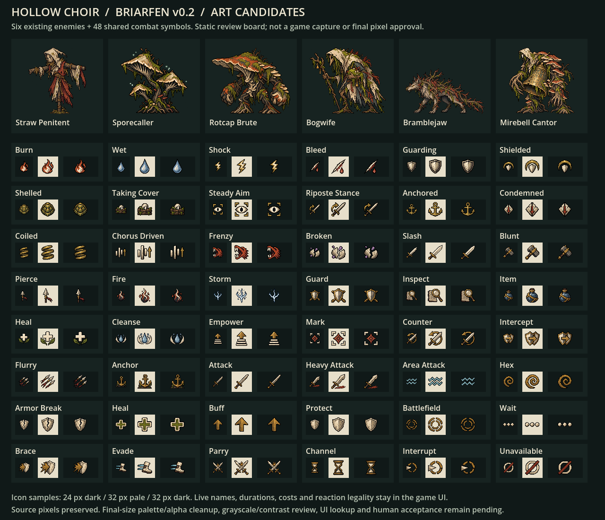
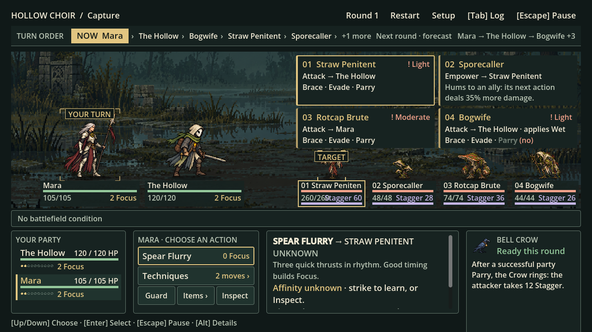
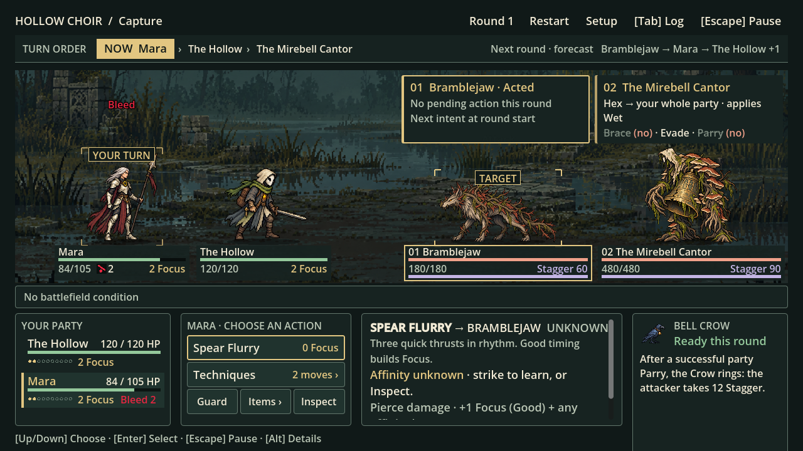

# Briarfen v0.2 — review evidence

8 October 2026 · Director art pass · candidates, not shipping approval

## Verified

- Godot **4.7.2** imported the nine selected source PNGs. All six single-frame SpriteFrames and
  48 AtlasTextures loaded with zero resource-check issues. Regions, square margins, dimensions,
  clipping, display-height/facing metadata and six enemy data bindings matched the manifest.
- Coverage checks found 19/19 player actions, 30/30 enemy moves, 4/4 active statuses, 11/11 buffs,
  10/10 intent categories, 3/3 reactions, 4/4 potions and 2/2 current conditions mapped.
- All nine selected source PNG hashes match the manifest. Files were copied without pixel edits.
  Declarative atlas regions exclude distant empty space; they are not alpha cleanup.
- Removing the new frame declaration and assignment from each of the six enemy definitions produces
  its original gameplay data from HEAD exactly (normalised trailing newline). No stats, moves, AI,
  resistances, rewards or status rules changed. Other uncommitted engineering work was preserved.
- `git diff --check` passed. No production GDScript was added or edited by this pass. Temporary
  packaging/validation/review utilities live outside the repository, not as shipped game systems.

## Visual evidence

The **asset review board** is a separate Godot-rendered inspection surface, not a battle capture.
It retains the texture resources while drawing and shows all 48 cropped glyphs at 24 px dark /
32 px pale / 32 px dark. Enemy cards fit their source silhouettes into review swatches. Basic shapes
are visible, but fine detail is lost at 24 px. Final contour, alpha, grayscale, contrast and human
discrimination checks remain open.

Actual working-tree battle captures: 1280×720, Starter Sword, seed 3, UNKNOWN research, reduced
decorative effects, compatibility renderer:

Mixed cast: Straw Penitent, Sporecaller, Rotcap Brute and Bogwife. This uses the existing capture
tool's temporary setup, not a new saved encounter. All four candidates appear with correct facing
and stable names/slots. **Clarity limitation:** the 2×2 intent rail leaves approximately 50–60 px for
their bodies; detailed silhouettes become tiny. HP/Stagger text also crowds the four-enemy nameplates.
This does not satisfy a claim that ART-02 or the four-enemy F1-A requirement is already passed.
Increasing display-height metadata cannot solve the shared layout shrink.

Bramblejaw and Mirebell Cantor: kinship/bell identity reads more clearly with the shorter two-slot
rail. This setup can resolve a faster enemy before the first party planning capture; visible Bleed
and HP changes are actual engine events. No clipping or double-flip was observed in this view.
It cannot validate four-enemy scale or final pixel quality.

## Pillar judgement

| Pillar | Evidence and limit |
|---|---|
| READ | Shared shapes support recognition. Four-enemy body size/nameplate crowding remains a concrete failure to resolve. |
| REACT | Reaction markers are supplied; live legality, binding and timing remain with existing widgets. UI lookup is pending. |
| ADAPT | Status/buff symbols can reinforce existing interactions. Texture existence does not prove player comprehension or adaptation. |
| EXPERIMENT | Shared families map all current moves without new rules. Human weapon-choice evidence remains pending. |
| AFFECT THE WORLD | Deferred by M1. Reclaimed material language supports narrative cohesion, not a persistent world system. |

## Environment limits and remaining work

The first editor import could not save preferences in the protected default roaming directory;
source texture imports completed. Later resource validation and runtime captures used an isolated
workspace settings location and completed cleanly. This checks the art package, not the other
uncommitted M1.1 engineering changes. No full gameplay suite or human session is claimed from loading.

The optional [HTML gallery](review.html) is saved but its browser rendering was not verified: the
local preview connection was unreachable and browser policy rejected the file URL. No browser-policy
workaround was used. The saved raster review board and actual Godot captures above provide local
evidence through normal file viewing. The gallery is supplementary, not acceptance proof.

Before shipping: artist cleanup at the guide's cells/palette targets; fix four-enemy layout; hook up
shared UI textures with procedural fallback and knowledge gating; check grayscale, composed contrast,
enlarged text, input modes and missing-art behavior; then record the existing M1.1 human gate.
See the [Claude brief](../../../docs/briefs/BRIARFEN_V02_ART_INTEGRATION.md).
