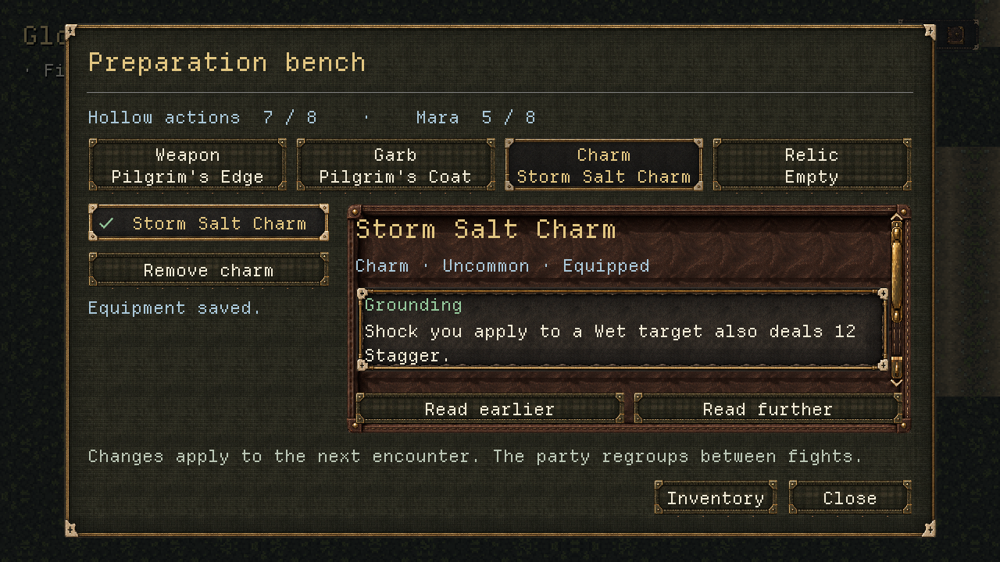

# V0.5A — Salvage and preparation presentation

Codex · 9 October 2026 · uncommitted shared `dev` after `35c8763`

This records the original integration pass. Adrian's subsequent character-menu, compact-loot
and effect-icon changes supersede the inventory layout and reading controls described below;
see [the follow-up](V0_5A_CHARACTER_MENU.md) for the current implementation and evidence.

The earned Storm Salt Charm is now equippable in play. The bench presents Weapon, Garb, Charm
and Relic, owned choices, equipped names, public traits/actions/resonance, and the Hollow's action
count against eight. Inventory is available from both the bench and pause. Successful world
accomplishments show saved reward cards; encounter cards show first-clear salvage; older saves
receive one catch-up notice after adoption. [Director acceptance](V0_5A_DIRECTOR_ACCEPTANCE.md)
answers all seven decisions, and [V0.5B's brief](../briefs/V0_5B_BACKEND_HANDOFF.md) specifies the
next backend stage. Application 0.3.0 / save version 1 remain unchanged.

## Implementation and boundaries

- `WorldPreparationView` and `WorldEquipmentDetails` present only `session.preparation()` facts.
  Selection emits slot/item IDs; `WorldHost` applies `equip` or `unequip` through `_commit`.
  Disabled choices show the supplied reason. Rejections rebuild the station from backend truth
  and show `last_preparation.text()`. The eight-action limit, ownership and station eligibility
  are never recalculated in a widget. Starter order and all owned weapon choices are retained.
- An equip failure uses Retry save and retains the station context. Successful retry restores
  the selected slot/item and focus, using callbacks that capture IDs/resources rather than freed
  controls. Close and any return to exploration end the context. Inventory inside preparation
  belongs to that same interaction and returns to the selected slot; paused Inventory opens none.
- `WorldInventoryView` presents approved material stacks and owned/equipped equipment from
  `session.inventory()`. It says materials have no use in this build. Reading or navigating writes
  nothing. All four equipment slots support campaign commands, including optional removal;
  empty slots remain understandable without granting placeholder equipment.
- `WorldRewardView` consumes each successful command's `last_receipts` exactly once in its own
  result view. No parallel EventBus listener duplicates them. Empty/no-addition receipts are
  omitted. Material totals are labeled “Stock after reward” because a catch-up batch contains
  cumulative receipts, not several separate descriptions of the final stock. The bell reward
  gives an explicit next step to equip at Gloamstead. Failed saves show no success receipt.
- `WorldEncounterView` renders the typed reward preview before the resource/free-leave notes,
  while preserving filtered creatures and public conditions. Already-claimed previews explain
  why replay grants nothing. The initial patrol/guard previews are visible without scrolling.
- Reuse the current cloth, leather-bag and inspection textures, Departure Mono at 22 px, gold
  focus and text-equipped state. Long details/receipts use fixed Read earlier / Read further
  controls, mouse scrolling and Page Up/Down; the close/engage actions stay outside scroll areas.
  The bench is 1120×664 on the fixed canvas; inventory 1120×624; encounter 880×624; saved reward
  frames 940×600. The eight-action paused menu fits a 480×624 frame. Resolution presets scale the
  complete canvas, as before.
- Two native stepped SVG material icons are wired through `MaterialDefinition.icon`; a neutral
  tied-parcel SVG replaces a potion-shaped fallback for equipment without art. All are original
  repo-native vector work, with [provenance](../art/SALVAGE_ICONS_V01.md). No painting generation,
  area edit or optional charm/armor asset was needed. Equip confirmation reuses the existing
  AudioManager UI-confirm cue after a successful save; no new SFX or listening acceptance.

The backend report remains historical and preserved. No combat numbers, salvage quantities,
claims, ownership rules, action counts, station restrictions, save schema or retry snapshots
were changed by this presentation pass. Existing `WorldWeaponDetails` is preserved; the new generic
equipment component consumes readouts rather than resolving weapon definitions in the UI.

## Rendered evidence

Fourteen actual Godot Compatibility renders: thirteen at 1280×720 and one at 1920×1080.
All were opened and inspected. These are seeded isolated fixtures, not a human playthrough.
Victory uses a synthetic BattleResult through the production host; charm restoration, station
equip and old-save catch-up use the real session commands with an in-memory successful writer.

| Evidence | What was checked |
|---|---|
| [Starter bench](v0_5a_presentation/bench.png) | Four slots, action counts, starter order, trait-first facts and fixed actions |
| [Equipped charm](v0_5a_presentation/bench-charm.png) | Checkmark/name/equipped state, removal, saved feedback; complete Grounding sentence initially visible |
| [Empty relic](v0_5a_presentation/bench-empty.png) | Honest empty state and disabled removal |
| [Inventory](v0_5a_presentation/inventory.png) | Both icons/counts, current owned gear, equipped state, future-crafting note and reading controls |
| [Patrol preview](v0_5a_presentation/encounter.png), [guard preview](v0_5a_presentation/guard.png) | First-clear reward/counts before Engage; unknown creature identities remain filtered |
| [Claimed preview](v0_5a_presentation/encounter-claimed.png) | Explicit no-repeat-reward wording on a reset-route fixture |
| [Victory](v0_5a_presentation/victory.png) | One saved receipt with addition, description and cumulative stock |
| [Charm reward](v0_5a_presentation/charm-reward.png) | Keepsake receipt, neutral equipment icon and return-to-bench instruction |
| [Catch-up start](v0_5a_presentation/catch-up.png), [catch-up end](v0_5a_presentation/catch-up-end.png) | Explanation plus all three receipts reachable; final charm and inventory/preparation instruction |
| [Paused menu](v0_5a_presentation/menu.png), [reset confirmation](v0_5a_presentation/reset.png) | Inventory access, eight actions fit; explicit salvage/claims retention and Cancel first |
| [1920×1080 charm](v0_5a_presentation/bench-charm-1920.png) | Actual uniformly scaled output with the same complete Grounding sentence and controls |



Reproduce from the repository using the isolated launcher (substitute the local Godot path):

```powershell
python tools/qa_godot.py --godot <Godot-console.exe> --home .godot/qa/v05a-director --hidden --rendering-method gl_compatibility --audio-driver Dummy --script res://tools/capture_world.gd -- --state=bench-charm --out=res://docs/reports/v0_5a_presentation/bench-charm.png
```

Use the states in the evidence filenames; `catch-up-end` uses `--state=catch-up --scroll-end`.
The 1080p capture uses `--state=bench-charm --size=1920x1080`. The capture runner has no disk-save
writer, and every run uses isolated `.godot/qa/v05a-director` settings/saves. The 1080p render is
actual output at that preset; no 1440p qualification is claimed.

## Verification in this pass

Godot 4.7.2; all Godot runs through `tools/qa_godot.py`, with the suite running alone. Results below
are from this integrated tree, distinct from Claude's earlier 358-test backend run.

| Check | Result |
|---|---|
| Reward filter, headless | 17 passed / 0 failed; 281 assertions |
| Preparation filter, headless | 13 passed / 0 failed; 334 assertions |
| Salvage filter, headless | 14 passed / 0 failed; 178 assertions |
| World filter, headless | 101 passed / 0 failed; 2,717 assertions |
| Full suite alone, headless | 365 passed / 0 failed; 5,214 assertions; 113.06 s |
| World filter alone, hidden native Compatibility | 101 passed / 0 failed; 2,717 assertions; 26.45 s |
| Script compilation | 270 scripts checked / 0 failed |
| Material validation | 264 checks / 0 failures |
| Isolated V0.5A demo | Exit 0; guard → salvage → bell → charm → station equip → disk reload → Grounding fires once, 16.8 Stagger and Break |
| Python tests | 10 tests OK; workspace-local temporary directory |
| Whitespace | `git diff --check` clean |

The full run reported only the inherited expected invalid-save diagnostics, rejected-action
warning and world-recovery warnings. The Python run initially hit an access denial inside the
Windows sandbox's default temporary directory; redirecting TEMP/TMP for that process to
`.godot/qa/v05a-python-temp` let all ten tests pass without changing code or needing elevation.
The earlier backend determinism/mutation evidence remains in Claude's report; this pass verifies
the integrated production paths with the complete suite and Wet → Shock demo.

Seven new host regressions cover charm UI save failure/retry/removal and focus, read-only inventory
round trips, disabled overflow and stale-choice rejection, failed bell restoration with a single
post-retry receipt, empty-slot bounded focus and reading, reaching the last catch-up receipt with
fixed controls, and first-clear salvage visible before engagement. Existing receipt/reconciliation
coverage now checks cards and explicit notices, not provisional lines. Existing weapon detail,
on-canvas action, selected-state and snapshot coverage is retained and updated for refreshed views.

## Remaining acceptance

Human gameplay/clarity, art, controller and listening gates remain **open**. Automated key/focus
fixtures and hidden renders do not pass a hardware-controller or listening session. The next
human sequence is guard → bell/charm → home/bench equip → untouched patrol, then the old-save/reset
and controller/listening sessions in the [Director note](V0_5A_DIRECTOR_ACCEPTANCE.md).
Materials cannot be spent yet. Forge/Stillroom is specified only. No release, commit or push was
performed, and no new balance claim is made.
