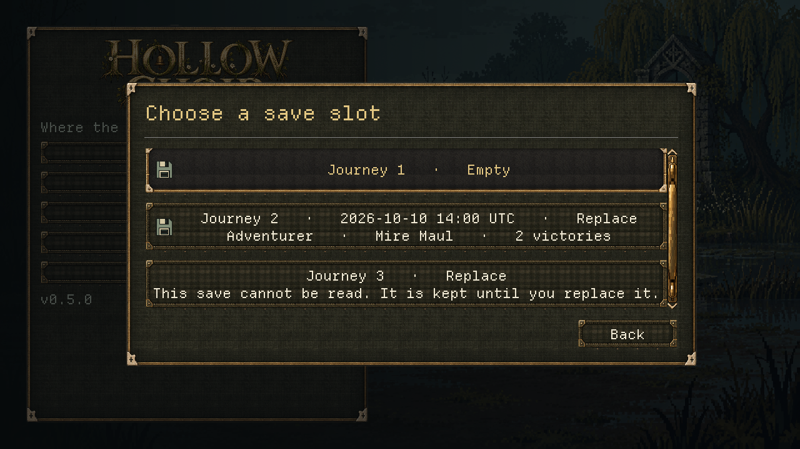
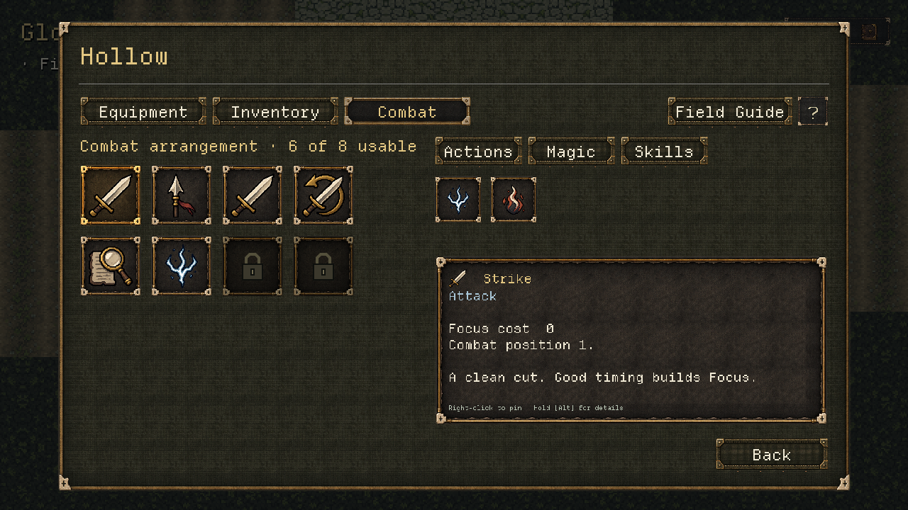

# V0.5 UI iteration — backend implementation

10 October 2026 · Claude (Lead Architecture, Systems & Backend) · shared uncommitted `dev` ·
application 0.5.0 / save version 1 (unchanged; both stay compatible).

Answers [the backend handoff](../briefs/V0_5_UI_BACKEND_HANDOFF.md) for Codex's
[journey/station/character prototype](../design/V05_UI_PROTOTYPE.md). All six items are real
transactions now: New Journey, hardened Continue, one save-event owner, field Equipment and
supplies, typed Forge/Stillroom services and the saved six-of-eight Combat arrangement. Every
change is copy → change → atomic write → adopt → publish, with typed readouts and results.
Nothing was committed, pushed, version-bumped, retuned or regenerated. Human, controller, art and
listening gates stay **open**.

## 0. Decisions for the Director and Adrian (please read first)

1. **Difficulty is now per journey (amends D-009).** The setup's difficulty is saved with the
   journey (`campaign.difficulty`) and encounter entries capture it. Settings still shows and
   changes it at any time: a change made during a journey becomes the journey's difficulty at once,
   in the live state, and the next save writes it (GDD "allow difficulty to change during an
   existing save" is kept). Loading or starting a journey shows its difficulty in Settings. Execution
   assist and every accessibility setting stay per player. **Older saves** have no recorded
   difficulty and load as **Adventurer** (the deterministic default the brief asks for); a player
   who used Tactician through Settings must pick it again once. Please log the D-009 amendment.
2. **Six positions, seven actions.** Every starter weapon grants seven actions (basic attack, two
   techniques, stance, Inspect, Spark, Kindle). With six usable positions one always waits outside.
   The deterministic default (new journeys and older saves) is the first six in the prototype's
   order, Actions then Magic, so **Kindle starts unplaced**. That is a real combat change for
   existing players: Kindle is not in their battles until they place it. It is listed with "Not in a
   combat position" and never hidden. Adrian's 9 October rule ("start with about six; trading slots is
   strategic") matches. Please confirm the default, or name another excluded action.
3. **Gear changes refill freed positions in grid order.** Each kept action stays in its position
   and the new gear's actions fill the freed ones. There is no per-weapon memory, so a custom sword
   order comes back in grid order after Sword → Maul → Sword. Per-weapon arrangements would be a
   later, separate rule.
4. **No-op equipment writes nothing.** Re-choosing the equipped item no longer saves (V0.5A did).
   That follows "no event for a no-op".
5. **Notices and battle.** The host hides the notice layer while a battle owns the screen. The
   encounter entry's save happens just before launch, so its card would otherwise cover the
   battle's action dock. Cards created meanwhile still expire on their usual timer.
   **For Codex:** at a station, a save card also covers the bottom-right Close button for about 3.4
   seconds. That was already true with the earlier host pushes. The card ignores the pointer, so
   Close still works, but it is hidden. This is a layout call.
6. **The old bench view stays internal.** `WorldHost.open_bench` and `WorldPreparationView` are not
   reachable from the world any more. Tests and a capture use them, so I kept them and removed their
   jumps into Forge/Stillroom services. Codex may retire them.

## 1. What changed

### New Journey (item 1)
- `MainMenu.new_journey_requested(options)` is connected in `_ready`, before any setup opens.
  Codex's emit `{difficulty, preset_id}` is unchanged. The listener then shows an **explicit save
  slot step**:
  - every slot is listed with its summary;
  - the first free slot is focused;
  - occupied and damaged slots read "Replace";
  - choosing one opens a separate **Replace Journey N?** card, with Cancel focused.

  With all three slots full, the step says so and only a confirmed replacement writes.
- `GameState.start_journey(options, writer)` → `JourneyRules.create`:
  - The request is typed and nothing is guessed: difficulty and preset must be approved, the slot
    must be named and in range, and an occupied slot needs `replace: true`.
  - The fresh journey is the complete fresh campaign (ProgressState defaults) with the preset weapon
    equipped, the difficulty and starter recorded, and the world at its start anchor.
  - It is written atomically to the chosen slot and **adopted only after success** (progress, active
    slot, resumed session, Settings difficulty). One `game_saved` follows, then the world opens.
  - A rejection or failed write changes no file, the live journey, the active slot or Settings. The
    slot step shows the reason, and choosing again retries the same request.
- **Presets** are data: `GameDefaults.journey_presets` holds Pilgrim's Edge, Mire Maul and Reedbow.
  Their names, descriptions, icons and facts come from `JourneyRules.setup()`. The rest of the party
  comes from the fresh campaign: Pilgrim's Coat, Mara, Bell Crow, Mending Draught and Fen Water Flask.
  `validate_catalog` proves each preset is a weapon a fresh campaign owns and that it needs no
  repair. The Practice loadouts were deliberately **not** reused: `starter_bow` carries Fenrunner
  Leathers and Focus Tincture, which a journey must earn.

### Continue and saves (item 2)
- `SaveManager.summary(slot) -> SaveSlotSummary` has a typed state: `EMPTY`, `READY`, `UNREADABLE`
  or `UNSUPPORTED`.
  - Times are explicit UTC (`2026-10-10 14:03 UTC`; a missing time reads "Time unknown").
  - It shows difficulty, weapon name and victories.
  - It reads quietly: a damaged file logs no engine error. Every field is type-checked.
  - Every non-empty state counts as occupied.
- `journeys()` lists READY saves newest first, with equal times ordered by slot number.
- Continue lists readable journeys plus disabled damaged or newer saves, each with its reason. A load
  that fails, for example because the file vanished after the list was built, keeps the live
  journey and active slot, says so and rebuilds the list.
- The slot count is `SaveSlotSummary.SLOT_COUNT` (3), and `SaveManager.SLOT_COUNT` aliases it.
  Pure rules use the class constant, because tool scripts compile them before the autoloads exist
  (§5).
- `load_slot` adopts only after parse and migration. `SaveMigrator` rejects a non-dictionary `data`.
  `ProgressState.from_dict` and the bestiary, world and entry readers are now type-safe for every
  section: valid JSON with damaged fields loads with defaults instead of crashing.

### Save events (item 3)
- `WorldSession.commit()` is the single owner. `EventBus.game_saved(slot, true)` is emitted once per
  successful world write, **after adoption**. There is no event for a failure, rejection or no-op.
- The audit found every listed boundary already saving exactly once: area arrival; story and station
  interactions; encounter entry, victory, return and leave; bell and latch; gather, search and every
  rune strike; manual Save, Save and return to title, and Save and Quit; Reset journey; world-entry
  catch-up. No extra write was added.
- All seven host `push_notice("Game Saved")` calls are removed.
- Save and Quit and Save and return to title run only after success (`quit_game` and
  `leave_to_title` are test seams). A failure offers Retry, which repeats the same save and keeps
  the safe anchor.
- `SaveManager.save_slot`, which records Practice battles, is unchanged.

### Field equipment and supplies (item 4)
- `equip`, `unequip`, `choose_weapon` and `prepare_potion` need **no station**; only a pending or
  active encounter rejects them (`ENCOUNTER_PENDING`). No station context is ever fabricated.
  `NO_STATION` is never returned for these.
- A changing equip reconciles the Combat arrangement **in the same write** and reports it
  (`PreparationResult.actions_removed/actions_added`, `summary()`). Each equipment option previews
  the same change (`option.combat`).
- Character Equipment sends the commands. A rejection or no-op reopens the same tab with the typed
  line, and a failed write offers Retry for the exact command.

### Distinct station services (item 5)
- `LandmarkDefinition.service`: `preparation_bench` (displayed "Forge") is `FORGE` and
  `stillroom_table` is `STILLROOM`. Validation requires a service on every PREPARATION landmark.
- `enter_station` opens the landmark's typed service. Kit purchase, refund and fit/remove need
  `FORGE`; Stillroom purchases need `STILLROOM`.
- The other station gets `WRONG_STATION` (21, `ERR_UNAVAILABLE`) with a reason naming the right
  station. A forged context (a landmark id the session never opened) gets `NO_STATION`.
- Standing near a station, saved anchors, closing, walking, transitions and combat behave as before.
- The host derives the crafting view's section from the landmark. The Forge-to-Stillroom jumps are
  gone, so each service opens only from its own station.
- Potion preparation is a field choice; recipe purchases stay Stillroom work.

### Combat arrangement (item 6)
- `CombatRules`:
  - Capacity is 6, derived and never saved (`STARTING_CAPACITY`, the future unlock seam). There are
    8 positions (`PartyLoadout.MAX_ACTIONS`, 2 locked).
  - Candidates are the granted actions, Actions then Magic.
  - `resolve` gives a deterministic, valid arrangement for any saved list. It keeps positions, frees
    duplicates and ungranted ids, then fills from the saved overflow first and the candidates after.
  - The commands are PUT (replace, swap when already placed, or fill), SWAP and MOVE (reorder).
  - It also provides the checks (`LOCKED_POSITION`, `INVALID_POSITION`, `UNKNOWN_ACTION`,
    `NOT_GRANTED`, `PASSIVE_SKILL`, `EMPTY_POSITION`), `repair` and `readout`.
- `WorldSession.arrange_action/swap_actions/move_action` are atomic field commands. The same
  arrangement is a no-op with no write.
- `WorldSession.combat() -> CombatReadout` publishes:
  - positions with lock, reason and action;
  - candidates with facts, source, `arranged`, position, eligibility and reason text;
  - `unarranged` actions;
  - skills: passives plus mastery facts, never arrangeable;
  - the companion's fixed actions.
- Battle: `battle_ids` adds `"actions"`, `EncounterEntry` captures them, and `UnitFactory.protagonist_actions`
  builds the hero's grid from them in order. Without an arrangement (Practice, the Lab, static
  loadouts, older entries) every granted action is used as before.
- The hard ceiling is unchanged: equipment checks still hold **all granted** actions to 8.
- Mara is not arranged, and potions stay in Supplies.
- Passives stay passives. `CharacterReadout` now also lists the **authored synergies the battle
  already applies**: the active resonance (Litany, from Pilgrim's Edge and Pilgrim's Coat, both
  Choir) and the familiar's trait.
- `WorldCharacterView` replaces `_preview` with the readout. It is Codex's layout and node names,
  with one functional change: selecting a position then a candidate sends PUT. The help and label
  copy now state that the arrangement is real.

## 2. Files

**Created**
- `src/save/save_slot_summary.gd`
- `src/progression/journey_rules.gd`
- `src/progression/combat_rules.gd`
- `src/progression/readouts/journey_result.gd`, `journey_setup_readout.gd`, `combat_result.gd`,
  `combat_readout.gd`
- Tests: `tests/unit/test_journey_rules.gd`, `tests/unit/test_combat_rules.gd`,
  `tests/world/test_world_journey_setup.gd`, `test_world_combat_arrangement.gd`,
  `test_world_save_events.gd`
- Captures: `docs/reports/v0_5_ui_backend/*.png`

**Modified: rules, data and save**
- `src/autoload/save_manager.gd`, `game_state.gd`
- `src/save/save_migrator.gd`
- `src/progression/progress_state.gd`, `bestiary_state.gd`, `preparation_rules.gd`, `crafting_rules.gd`
- Readouts: `character_readout.gd`, `preparation_readout.gd`, `preparation_result.gd`,
  `equipment_slot_readout.gd`, `crafting_readout.gd`, `crafting_result.gd`
- `src/data/encounters/party_loadout.gd`
- `src/battle/rules/unit_factory.gd`
- `src/data/config/game_defaults.gd` and `data/config/defaults.tres` (presets)
- `src/core/definition_registry.gd`
- `src/world/landmark_definition.gd` and `data/world/first_footsteps.tres` (two `service` lines)
- `src/world/world_session.gd`, `encounter_entry.gd`, `world_state.gd`, `world_copy.gd`
  (placeholder copy)
- `data/crafting/forge_first_fitting.tres`: the description says "at the Forge anvil" instead of
  "the bench"

**Modified: integration in Codex's files (functional only)**
- `scenes/main/main_menu.gd`: listener, slot step, replace card, typed summaries, stale-load
  handling, `enter_world` and `journey_writer` test seams
- `src/world/world_host.gd`:
  - service-derived stations;
  - Character field, potion and combat commands;
  - removed save pushes and notices hidden in battle;
  - Settings difficulty follow;
  - the `quit_game` and `leave_to_title` test seams.
- `src/ui/world/world_character_view.gd`: the real arrangement
- `src/ui/battle/presentation/item_inspection_readout.gd`: the station sentence

**Modified: tools and tests**
- Tools:
  - `tools/capture_runner.gd`: `title-slot` and `title-replace` states;
  - `tools/capture_world_runner.gd`: each station state opens its own landmark;
  - `tools/demo_v05a_runner.gd`, `demo_v05b_runner.gd` and their launchers: field equipment, and
    the anvil versus the Stillroom. Both demos were already broken by the prototype's interaction
    change.
- Existing tests updated to the new contracts:
  - `test_world_crafting`, `test_world_preparation`, `test_world_session`, `test_world_salvage_host`;
  - `test_world_ui_prototype`, `test_world_v05_integration` (Codex's; I changed only the
    assertions about the old preview and `NO_STATION` behaviour, as the brief asks, plus one
    timing fix in the station walk, §5);
  - `test_save_and_settings` (new cases appended).
- Docs: `docs/DATA_CONTRACTS.md` (save sections, settings, landmarks, GameDefaults, PartyLoadout,
  the new "V0.5 UI backend" section, superseded notes), `docs/TESTING.md`,
  `docs/briefs/CLAUDE_RETURN_QUEUE.md`.

## 3. Save impact

Save version **1** stays and remains compatible both ways for the new keys:
- `campaign {difficulty, starter}` and `combat {actions}` are optional;
- old saves default deterministically: Adventurer, no starter, and the derived arrangement;
- `EncounterEntry.loadout.actions` is optional, and older entries keep every granted action;
- an old or edited arrangement larger than six, or naming ungranted ids, is repaired once at world
  entry (`CombatRules.repair`), with a repair line.

An older build that rewrites a new save drops the keys, which is the documented pattern;
downgrading is not supported.

## 4. For Codex: API guide

- **Title**
  - `JourneyRules.setup(Database.registry, SaveManager.summaries(), default_difficulty)` returns
    `difficulties`, `presets` (`id`, `name`, `description`, `icon_path`, `category`, `facts`,
    `details`), `slots`, `default_*`, `suggested_slot` and `all_full()`.
  - Emit `new_journey_requested({difficulty, preset_id})` and the listener runs the slot step. With
    your own slot UI, emit `{…, slot, replace}` instead; `GameState.last_journey.text()` gives the
    typed reason.
  - `SaveManager.journeys()` for Continue; `slot_text()` in `MainMenu` is engineering formatting.
- **Equipment**
  - `option.selectable` and `reason_text` now reflect the field rules.
  - `option.combat.removed/added` previews arrangement changes. The host puts
    `last_preparation.summary()` in the modal status after a command.
- **Combat**
  - `session.combat()` drives the view.
  - Emit `combat_requested(&"put", position, action_id, -1)`. `&"swap"` (positions) and `&"move"`
    (reorder) are ready for drag and drop.
  - `position.locked` and `reason_text` cover the two locks.
  - `candidate.arranged`, `position` and `reason_text` say whether an action is in battle.
  - `skills` are inspection only (`reason_text` explains why).
- **Stations**
  - `CraftingReadout.service`.
  - Each recipe's `purchase_reason_text` names the right station.
  - Display counts: `FITTING_SOCKETS`, `POTION_POSITIONS`, `fitting_capacity`, `potion_capacity` and
    `locked_reason_text`, so the locks need not be hard-coded.
- **Copy:** every new line in `WorldCopy` (`JOURNEY_*`, `SAVE_SLOT_*`, `COMBAT_*`,
  `CRAFT_WRONG_STATION_*`, `PREP_SAVED/UNCHANGED`, and the re-pointed `REWARD_*_NEXT` and
  `MATERIALS_NOTE`) is an engineering placeholder.

## 5. Verification

Final runs on 10 October 2026, one at a time, each Godot run in a fresh isolated QA home
(`tools/qa_godot.py`), after a headless re-import. They cover the tree as it stands in this report,
including the fixes listed after the table.

| Check | Result |
|---|---|
| Full headless suite before this pass (baseline) | 419 passed, 0 failed, 6,472 assertions |
| Script check (`check_scripts.gd`) | 315 scripts, 0 failed |
| Tool entry points compiled before autoloads (`--check-only`, new) | 20 of 20 clean |
| Full headless suite | **450 passed, 0 failed, 7,248 assertions** |
| Full rendered suite (Compatibility, Dummy audio, hidden window) | **450 passed, 0 failed, 7,272 assertions** |
| Determinism probe against a `35c8763` clone | identical: 120 battles, total `8c68fa1d…` |
| Simulation smoke (`--encounter=all --exec=MIXED --runs=10 --seed=1`) against `35c8763` | identical |
| Material polish validator | 264 checks, 0 failures |
| World art validator | 376 checks, 0 failures after a separate fix (see below); 328/1 before it |
| Python tool tests | 10 passed |
| Demos A, B and C | all finish, no errors |
| Mutation checks (scratch `mutate_ui.py`) | 28 of 28 caught, after one test fix (item 4) |

- The determinism probe plays 120 battles: every encounter × the four shipped loadouts and the sword
  with the Storm Salt Charm × seeds 11, 222 and 3333. It hashes every event field and the input log.
  Static loadouts never carry an arrangement, so battles are unchanged.
- Expected diagnostics in both suites, all declared by their tests:
  - nine invalid-save errors: six from `test_save_and_settings`, three from
    `test_world_journey_setup` loading its damaged and newer slots;
  - the `Needs 5 Focus` warning;
  - five `WorldSession` sanitation warnings from `test_world_session`.
- The mutation runner reverts one behaviour at a time in a scratch copy. Each mutation must make
  its named suite fail, and not through a parse error. The 28 mutations cover: save-event ownership
  and order, failed writes, cards over battle, field equipment and supplies, both station checks,
  the arrangement in battle, locked positions, capacity, refill, duplicates, gear reconciliation,
  entry capture, passives, occupied slots, guessed slots, adoption, difficulty, the fresh journey,
  quiet summaries, tie order, the data section and Settings difficulty.

**Found and fixed during final verification**
1. **Tool startup compile error.** `JourneyRules` and `JourneyResult` named `SaveManager.SLOT_COUNT`.
   The registry's `validate_catalog` pulls them into every `--script` tool, and those compile before
   the autoloads exist. As a result, `simulate.gd` and `validate_material_polish.gd` printed
   `Identifier not found: GameState` at startup. They still ran, but the error was new.
   `SaveSlotSummary.SLOT_COUNT` now holds the count. A new check compiles every tool entry with
   `--check-only`: it reports the error on the old tree and is clean now (`TESTING.md`).
2. **Intermittent failure in Codex's station reachability test** (1 of 4 full runs).
   - The test walked with direct `player.step()` calls inside a process frame. There,
     `move_and_slide()` uses the process delta.
   - A frame under about 2 ms left the feet 59.9 px from the station, beyond its 56 px reach. A
     probe with a 1 ms frame reproduced the logged `'id' on Nil` error on both stations.
   - The test now awaits a physics frame first, as the other world walkers do. The steps are a
     fixed 1/60 s, and the feet stop against each station at 25 px and 9 px.
   - The station geometry was never at fault.
3. **New GDScript warnings in my code.** A scan promoted Godot's default warnings to errors in a
   scratch copy and compared it with `35c8763`. I fixed every warning that came from this pass or
   from my earlier V0.5B/C work. Each fix is behaviour-neutral:
   - an unassigned `first` in the slot step;
   - locals shadowing members in `PartyLoadout`, `ProgressState`, `BestiaryState` and `WorldState`;
   - an incompatible ternary in the potion repair;
   - two lambda parameters in `test_world_crafting`.

   Left as they are:
   - established patterns: `EventBus` unused-signal warnings, and the static `SaveManager` helpers
     called through the autoload, as `test_save_and_settings` already does;
   - Codex's files: `world_crafting_view.gd:31` (`material`), `world_map_view.gd:48/67/85`
     (`scale`) and `world_preparation_view.gd:103/140` (`first` unassigned).
4. **A weak test found by mutation.** The first mutation run caught 27 of 28. Removing the
   migrator's data-section check still passed `test_save_and_settings`: the missing key and the
   Array cast then failed as runtime errors, with the same count of two and the same empty result.
   The test now also captures the messages with a local `TestErrorLogger` and requires both to be
   the migrator's own rejection. Re-run, the mutation is caught.

**Fixed separately, not part of this pass:** `tools/validate_world_art.gd` failed one check,
`Scene embeds stale frames: hollow`, and failed identically on a `35c8763` clone. The Hollow scene
uses `hollow_motion_v05`, but the validator still expected `v03`. A separate task (another Claude
session, same day) changed only that tool and its `TESTING.md` note:
- one pinned constant, `HOLLOW_FRAMES := "hollow_motion_v05"`;
- the motion checks read the frames the scene actually uses;
- the standing idle frames now get the same cell, transparency and foot checks.

I re-ran it here: 376 checks, 0 failures. Material polish is still 264/0, the validator compiles
before autoloads and the script check is still 315/0. No test uses the tool, so the suite results
above stand for the current tree.

## 6. Screenshots

Actual 1280×720 Compatibility captures, taken with the isolated fixtures in the capture tools.
They are fixtures, not a human playthrough.

| Screen | Capture |
|---|---|
| Continue: typed summaries (UTC, difficulty, weapon) | [title-saves](v0_5_ui_backend/title-saves.png) |
| New Journey slot step: free slot focused; occupied and unreadable slots offer Replace | [title-slot](v0_5_ui_backend/title-slot.png) |
| Deliberate replacement, Cancel focused | [title-replace](v0_5_ui_backend/title-replace.png) |
| Combat: the saved six plus two locks | [character-combat](v0_5_ui_backend/character-combat.png) |
| Combat, Magic filter: Kindle listed outside the six | [character-magic](v0_5_ui_backend/character-magic.png) |
| Equipment in the field | [character-equipment](v0_5_ui_backend/character-equipment.png) |
| Forge anvil | [forge](v0_5_ui_backend/forge.png) |
| Stillroom: field potion, plus the save card over Close (see §0.5) | [stillroom-potion](v0_5_ui_backend/stillroom-potion.png) |

## 7. Known limitations and future extension points

- Capacity growth is a single seam (`CombatRules.capacity`). The future rule adds authored unlocks
  there, never a saved counter. The fitting and potion display locks are constants only.
- No per-weapon arrangement memory (§0.3).
- The title's slot step and replace card are functional engineering UI in Codex's style
  components. Codex owns their final look and copy.
- A difficulty change made in Settings but never followed by any save is lost if the game is closed
  through the window frame (as discovered map knowledge is). Every in-game exit saves first.
- The Combat view sends PUT only. SWAP and MOVE are ready for a drag-and-drop iteration.
- CI could run the tool-entry `--check-only` loop from `TESTING.md` and fail on any output. I left
  `.github/workflows/ci.yml` unchanged because I cannot exercise it locally.

## 8. Human gates (still open)

Fresh journey on each difficulty and starter; Continue with three, one and zero saves; replacing a
journey; damaged-save handling; field equipment and potions; the Combat arrangement in real battles
(including the missing Kindle); both stations and their rejections; save cards; Save and Quit;
mouse, keyboard and controller; readability; art fit; and listening. Automated checks do not pass
these gates.
