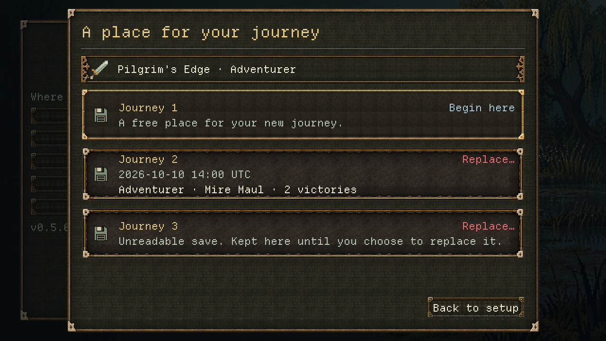
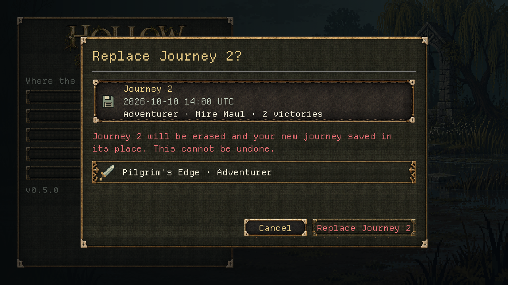
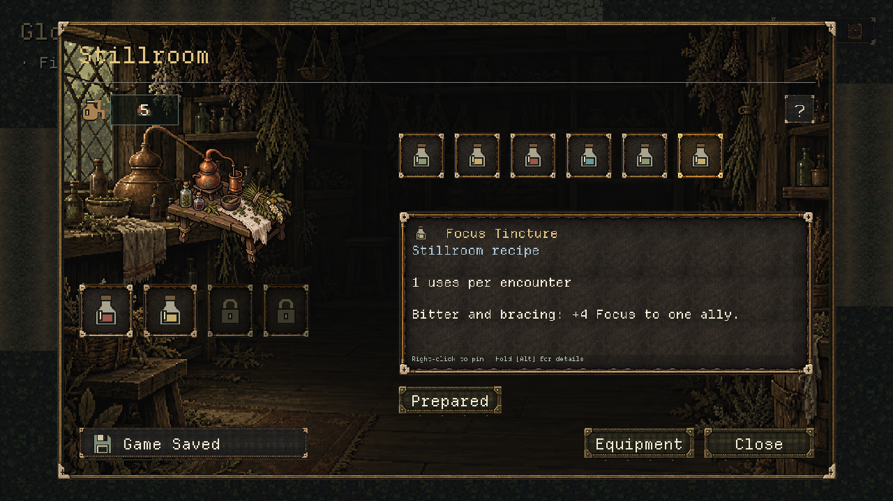
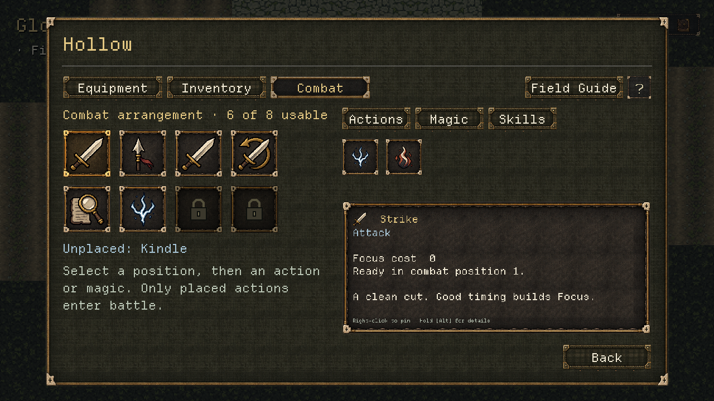

# V0.5 UI — Director presentation return

10 October 2026 · Codex, Creative & Frontend Director · shared uncommitted `dev`.
Application **0.5.0**, save version **1**. Responds to
[Claude's backend return](V0_5_UI_BACKEND_IMPLEMENTATION.md).

The integrated UI is ready for [Adrian's full human test](../playtests/V0_5_INTEGRATED_TEST.md).
[Director acceptance](V0_5_UI_DIRECTOR_ACCEPTANCE.md) rules on all six decisions;
D-049–D-054 record them in [the Decision Log](../DECISION_LOG.md).
Human, controller, art and listening gates remain **open**.

## Presentation changes

- **Save places:** one stitched card per journey, with name, explicit UTC save time, difficulty,
  weapon and victories on distinct lines. Free places say Begin here; occupied/damaged places
  say Replace… and open the existing separate confirmation. Initial focus remains the first free
  place, or the first occupied place when full. Continue shares the same readable cards and keeps
  newest-first ordering and disabled damaged/newer saves.
- **Setup recap:** the selected starter and difficulty stay above the save choices. Back to setup
  retains choices. All three cards fit at 1280×720 with the full-list or failed-write message; the
  recap cannot scroll away. The earlier setup-preview label is replaced with the actual next step,
  and the button says Choose save place. Its frame now fits the complete setup explanation.
- **Replacement:** a separate card shows the journey being erased, followed by a direct irreversible
  loss statement and the proposed new setup. Cancel starts focused. Replacement is named for its
  exact journey and marked in threat colour as well as words. A damaged save gets the same deliberate
  review; reading or cancelling changes no bytes.
- **Final copy:** all requested JOURNEY, SAVE_SLOT, COMBAT, wrong-station, preparation-result,
  reward-next-step and materials lines are reviewed. Field equipment/supplies, the two separate
  Gloamstead services, passive skills, locked positions and battle availability now describe the
  working contracts. Existing technical identifiers remain behind the presentation boundary.
- **Combat:** a visible Unplaced line names Kindle initially and follows the saved arrangement
  after replacement (for example, Spark). The short placement instruction states that only placed
  actions enter battle. The existing position-then-candidate control remains the supported input.
- **Save cards:** station, Character, Inventory and internal bench frames reserve a 330×48 footer
  dock beside their fixed actions. The coalesced save confirmation occupies it without moving or
  covering Close, Back, Equipment or the service commands. Exploration and other menus keep the
  ordinary stack. Returning to exploration restores the 330×76 card. Lifetime, queue, pointer
  transparency, reduced motion and battle hiding remain intact; presentation emits no saves.
- **Reported warnings:** rename the crafting ingredient and map scaling locals; explicitly
  initialise legacy preparation focus candidates. These are behaviour-neutral changes.

Existing authored materials, icons, scenes and station backdrops are reused. No new raster assets
or authored-area regeneration. Drag and drop and retirement of the internal bench are deferred;
their existing API/tests/capture stay available.

## Fresh verification

Each Godot process ran alone through `tools/qa_godot.py` on stock Godot 4.7.2. QA homes and logs
live under the ignored `.godot/qa-director/` directory, with different homes for the full runs.
Player saves/settings are untouched. Final suite counts are recorded below.

| Check | Fresh result |
|---|---|
| All script compile check | 315 checked, 0 failed |
| Full headless / Dummy audio | **452 passed, 0 failed, 7,359 assertions** (118.72 s) |
| Full Compatibility / Dummy audio, hidden window | **452 passed, 0 failed, 7,383 assertions** (117.05 s) |
| Rendered evidence | 13 PNGs: 12 canonical 1280×720, one 1920×1080 |

Existing transactional coverage is retained. Two presentation tests are added: card bounds and
whole-card pointer ownership with damaged-save cancellation; and both station footer receipts,
ordinary/reduced motion, restored exploration stack and unchanged write counts. The title flow
also guards all three cards fitting under failure/full-list status, the setup recap and replacement
facts. Station integration checks real potion Retry with disjoint fixed actions. Combat checks the
visible unplaced action before and after placement, plus the final equipment-result wording.

The first full run was 449/1: the new footer bounds assertion caught the old 76 px minimum still
constraining the compact card. Corrected the minimum in both layout contexts; focused station and
notice suites then passed. Rendered review caught clipped choices when status wrapped; fixed recap
placement, bounded copy and spacing, and added full-card viewport assertions. Final results above
cover those fixes. The documented invalid-save errors and sanitation warnings remain intentional.

Claude's determinism, simulation, mutation and art-validator results remain in his backend report.
They were not rerun or claimed as fresh evidence for this presentation pass. No battle-rule,
balance or save-transaction implementation was changed.

## Rendered evidence

Actual Compatibility/Dummy captures of production scenes using isolated fixture saves and commands.
The failed-write fixture injects a failing writer. These are **fixtures, not a human playthrough**.
They establish the displayed layout, not controller feel, audible quality or human comprehension.

| State | Evidence |
|---|---|
| Setup with complete next-step copy | [New Journey](v0_5_ui_presentation/title-new.png) |
| Continue, newest first | [Continue](v0_5_ui_presentation/title-saves.png) |
| Free, occupied and damaged places; free place focused | [Save places](v0_5_ui_presentation/title-slot.png) |
| Every place occupied; all three cards visible | [Full list](v0_5_ui_presentation/title-slot-full.png) |
| Failed write; choices, setup and recovery text remain visible | [Write failure](v0_5_ui_presentation/title-slot-failed.png) |
| Replace exact journey; Cancel focused | [Replacement](v0_5_ui_presentation/title-replace.png) |
| Damaged-save replacement | [Damaged replacement](v0_5_ui_presentation/title-replace-damaged.png) |
| Same save-place layout at a supported larger preset | [1920×1080](v0_5_ui_presentation/title-slot-1080.png) |
| Forge purchase saved; Close remains visible | [Forge](v0_5_ui_presentation/forge-receipt.png) |
| Stillroom potion prepared; Close remains visible | [Stillroom](v0_5_ui_presentation/stillroom-potion.png) |
| Magic filter with visible Unplaced: Kindle | [Combat](v0_5_ui_presentation/character-magic.png) |
| Field Equipment retained | [Equipment](v0_5_ui_presentation/character-equipment.png) |
| Ordinary exploration notice stack retained | [Notices](v0_5_ui_presentation/notices.png) |









Reproduce through the QA launcher, with the Windows Godot executable supplied using `--godot`:

```text
--headless --audio-driver Dummy --script res://tests/run_tests.gd
--hidden --rendering-method gl_compatibility --audio-driver Dummy --script res://tests/run_tests.gd
--hidden --rendering-method gl_compatibility --audio-driver Dummy --script res://tools/capture_battle.gd -- --state=title-slot --out=res://docs/reports/v0_5_ui_presentation/title-slot.png
--hidden --rendering-method gl_compatibility --audio-driver Dummy --script res://tools/capture_world.gd -- --state=stillroom-potion --out=res://docs/reports/v0_5_ui_presentation/stillroom-potion.png
```

## Files and handoff

Presentation: `scenes/main/main_menu.gd`, `src/world/world_copy.gd`,
`src/ui/world/world_modal.gd`, `journey_notices.gd`, `world_character_view.gd`, plus the host's
notice-dock attachment/detachment. Warning cleanup: `world_crafting_view.gd`, `world_map_view.gd`,
`world_preparation_view.gd`. Tests: `test_world_journey_setup.gd`, `test_world_ui_prototype.gd`,
`test_world_v05_integration.gd`, `test_world_combat_arrangement.gd`. Capture fixtures:
`tools/capture_runner.gd`. Documentation: both Director reports, Decision Log, current design
authority, TESTING, return queue and integrated human checklist. Rendered PNGs are in the directory linked above.

All pre-existing uncommitted work is preserved; no reset, commit or push. Application/save versions
remain 0.5.0/1. Adrian's next step is the updated [integrated human checklist](../playtests/V0_5_INTEGRATED_TEST.md),
including fresh starts and replacements, older saves, real arranged battles, field gear/supplies,
both stations and rejections, save/exit failures, mouse/keyboard/controller, readability, art and listening.
