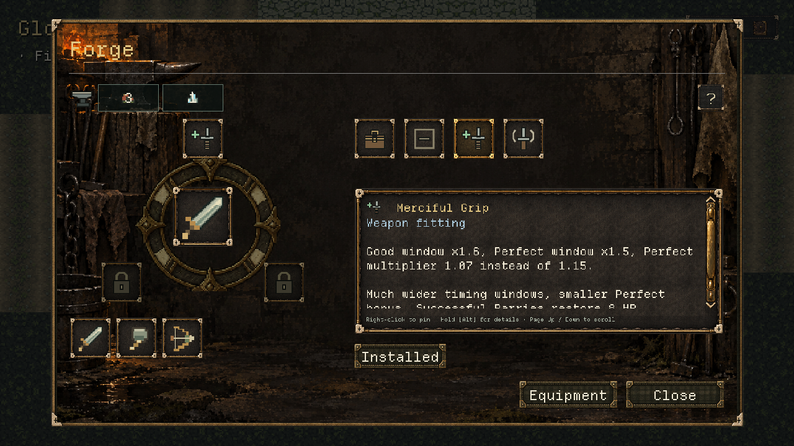
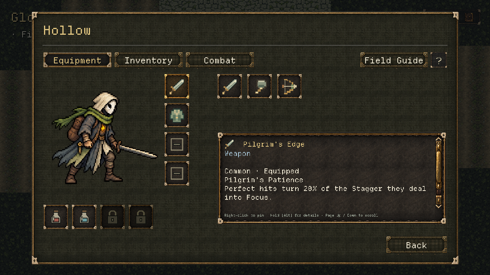
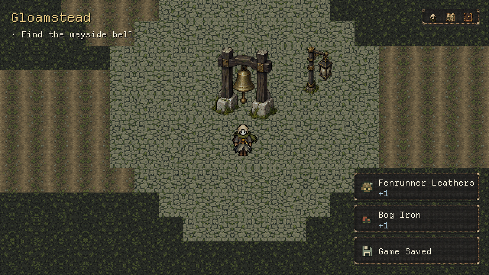

# V0.5 — Revised UI prototype and Claude handoff

Codex · 10 October 2026 · shared uncommitted `dev` · application 0.5.0 / save 1.

Adrian's requested frontend iteration is implemented for review. It supplies the five-choice title,
chronological save picker, new-journey setup view, dedicated Forge/Stillroom props and backdrops,
icon-led Equipment/Inventory/Combat layouts, circular map labels and textured paths, Character-owned
Field Guide, revised pause actions and stacked save/pickup cards.

**Backend boundary:** New Journey creation is not enabled. Combat arrangement is an explicitly
unsaved local preview; actual battle actions are preserved. Equipment changes still require an
open station because existing backend validation remains authoritative. Global autosave-event
ownership, field preparation, distinct service restrictions and persistent Combat arrangement are
specified in [Claude's ready-to-paste handoff](../briefs/V0_5_UI_BACKEND_HANDOFF.md).
No commit, push, version change, combat retune or authored-area regeneration was performed.

## Try the build

Run the project in Godot. Continue Journey opens saved files newest first. Without saves, F10 →
Preview journey in a debug build opens the current slice while real New Journey creation awaits
Claude. No QA run uses the player's normal profile. Read
[the full updated A/B/C checklist](../playtests/V0_5_INTEGRATED_TEST.md).

- **A:** salvage previews/receipts, ten initial pockets and five permanent bell-reward pockets,
  item/ingredient inspection, Equipment filtering and commands, authored character facts and
  current passives, Field Guide. Try the Storm Salt Charm with Wet + Spark and Grounding.
- **B:** anvil Forge, kit purchase/refund, Merciful Grip/Hollow Echo/none, owned weapon inspection,
  dedicated Stillroom, two permanent recipes and two distinct prepared supplies. Expanded facts
  retain mastery, costs, bases, catalysts, exact traits and rejection reasons behind inspection/Help.
- **C:** once-per-save iron seam, written listening clue, three etched rune props/tones, saved
  mistakes/progress/solve, revealed drowned niche and once-per-save Fenrunner Leathers reward.
- **UI:** five-choice title, circular discovered map, compact bag with ingredients below, character
  render and four gear slots, six-plus-two Combat preview, Field Guide return, clean pause menu,
  Game Saved / pickup cards that stack without displacing controls. Try Reduced Motion.

## Actual verification

| Fresh run | Result |
|---|---|
| Script compilation | 303 checked, 0 failed |
| Full headless suite, run alone | 418 passed, 0 failed; 6,466 assertions; 117.62 s |
| Full rendered Compatibility/Dummy suite, run alone | 418 passed, 0 failed; 6,490 assertions; 115.65 s |
| Final focused UI regressions, including Help | 8 passed, 0 failed; 74 assertions |
| Generated PNG metadata/provenance | Four byte-identical copies; both props RGBA with alpha range 0–255 |
| Whitespace diff check | Passed |

Logs: `.godot/ui-prototype-scripts-final.log`, `.godot/ui-prototype-full-headless2.log`,
`.godot/ui-prototype-full-rendered.log`, `.godot/ui-prototype-help-tests.log`.
Both suites used isolated homes via `tools/qa_godot.py`; no captures or other Godot sessions ran
alongside either complete suite. The corrupt-save test intentionally logs its declared rejection;
unknown-world-ID tests intentionally warn while sanitizing. Neither is an unexpected failure.
Assertion totals can differ between rendered/headless frame-dependent checks; test counts match.

The first headless UI run caught legacy tests expecting six title buttons and focus on disabled
Continue; those expectations were updated to the requested five choices and enabled-button focus.
Render review caught a container minimum-size problem in pickup cards, an initially clipped bag
row, and a Stillroom candidate row scrolling partly off-screen. Those were corrected and the
complete suites passed afterward. Legacy backend transaction/retry/reset coverage is retained;
new public-navigation tests cover the replaced UI flow.

Final Help-overlay review then corrected a narrow label minimum and added arrow/Page Up/Down
scrolling from the Help toggle. All eight focused UI tests pass after that small follow-up; the
418-test complete-suite results above precede it. No gameplay or persistence code changed in
that follow-up. Forge Help was recaptured and visually inspected with readable paragraphs.

## Rendered screens

These are actual Godot 1280x720 Compatibility captures. Save-list dates/slots, funded stations,
claimed salvage and stacked notices use isolated presentation fixtures. They do not claim the
player earned those rewards or that new-journey backend work is complete.

| Screen | Capture |
|---|---|
| Title, empty Continue | [title](v0_5_ui_prototype/title.png) |
| New Journey setup preview | [setup](v0_5_ui_prototype/title-new.png) |
| Chronological save picker | [saves](v0_5_ui_prototype/title-saves.png) |
| Credits/update placeholder | [credits](v0_5_ui_prototype/title-credits.png) |
| Forge: fitted weapon and candidate facts | [Forge](v0_5_ui_prototype/forge.png) |
| Forge Help overlay | [Help](v0_5_ui_prototype/forge-help.png) |
| Stillroom: second prepared potion | [Stillroom](v0_5_ui_prototype/stillroom-potion.png) |
| Equipment: character, gear and supplies | [Equipment](v0_5_ui_prototype/character-equipment.png) |
| Inventory: compact pockets and ingredients | [Inventory](v0_5_ui_prototype/inventory.png) |
| Combat: six preview positions plus two locks | [Combat](v0_5_ui_prototype/character-combat.png) |
| Full discovered chart | [map](v0_5_ui_prototype/map-full.png) |
| Save and pickup stack | [notices](v0_5_ui_prototype/notices.png) |
| Pause | [pause](v0_5_ui_prototype/pause.png) |
| World anvil / Stillroom | [anvil](v0_5_ui_prototype/station-forge.png), [table](v0_5_ui_prototype/station-stillroom.png) |

## Art, audio and remaining review

Four new PNGs and thirteen native icons are saved in `assets/art/global/ui/journey_v05/`, alongside
the native textured path stamp. Existing Hollow/item/material art and atlas rings are reused.
[Art provenance](../art/JOURNEY_UI_V05.md) records final paths, hashes, dimensions, alpha,
**built-in image generation mode** and the normalized prompt set. No new audio delivery is needed:
approved music and existing confirmation cues remain; the earlier three exploration stone tones
retain their separate manifest. Technical tests do not certify listening or licensing.

Human review still covers the new style, circular map-name readability, icon recognition, hardware
controller feel, station placement, listening comfort and combat balance. The environment-map
illustration remains future work. Two future Forge sockets and potion positions remain locks.
Do not treat the frontend diagram as authorization for additional mechanics.
